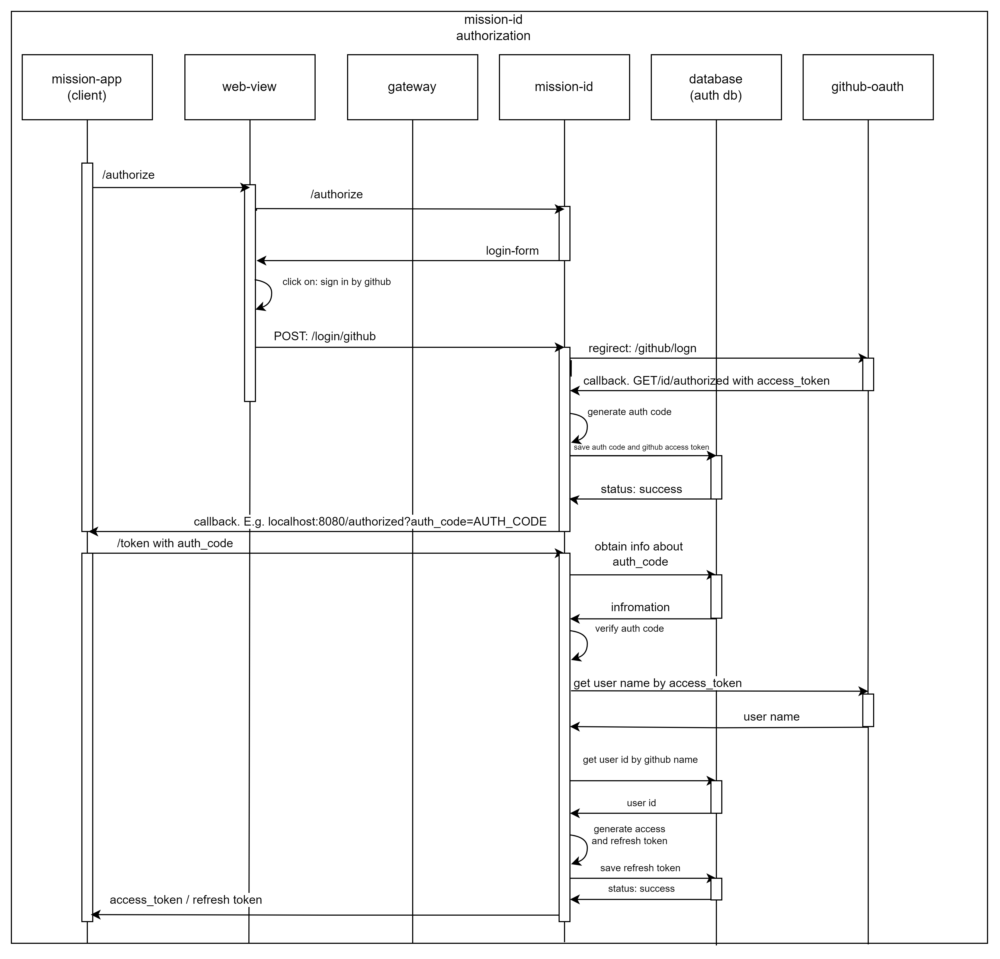

# Mission-id service

authorization service for identify users in mission ecosystem by login/passwod form and social login services

Ожидаемый результат:
Страница авторизации представляет форму с вводом логина/пароля и возможностью авторизации через соц. сети
сервис реализует протокол OAuth2.1

Алгоритм авторизации/authorization scheme:
