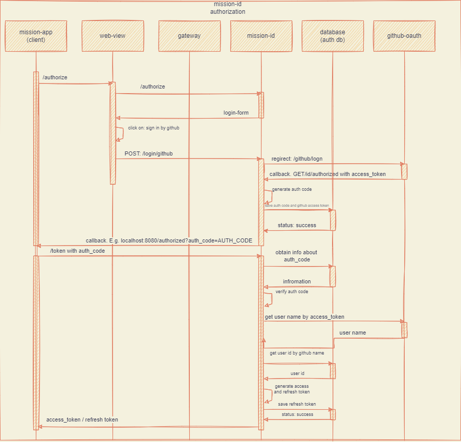
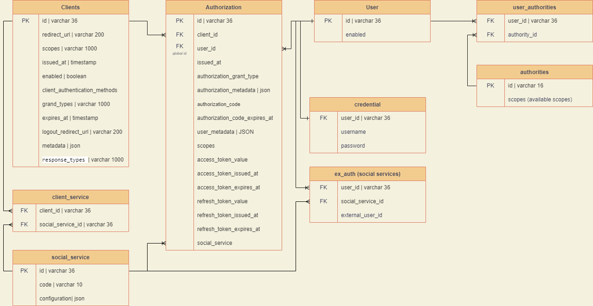
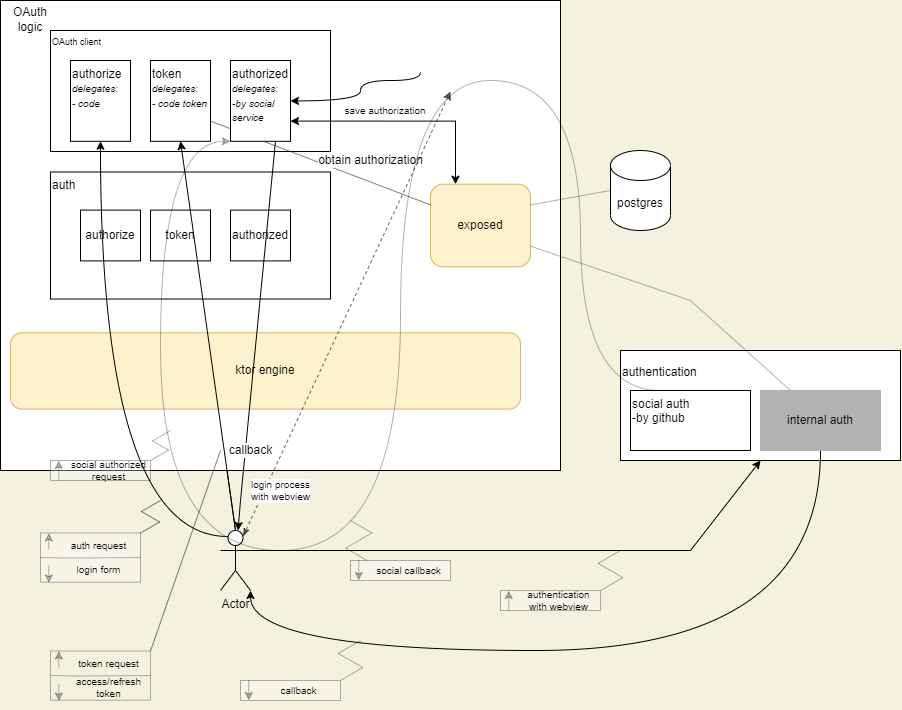

# Mission-id service

> authorization service for identify users in mission ecosystem by login/passwod form and social login services

Ожидаемый результат:
Страница авторизации представляет форму с вводом логина/пароля и возможностью авторизации через соц. сети
сервис реализует протокол OAuth2.1

## Available authorizations flow
1) Authorization code with PCKE (with refresh code)

## Technologies used

Используемые технологии:
1) ktor
2) exposed
3) jjwt

## Documentation in pictures

Алгоритм авторизации/authorization scheme:

Схема базы данных

# Road map
1) ~~make simple application~~
2) add client setting
3) add other social services and optimize controlling
4) optimize authorization database
5) refresh tokens
6) auth with login-form
7) registration users
8) improve security

# Prototyping

# additional info

for local setup ssl you can generate certificate by using module GeneratorSslKeys and Main.kt. 
After execute the main method keystore.jks will be generated in build folder GeneratorSslKeys module.
