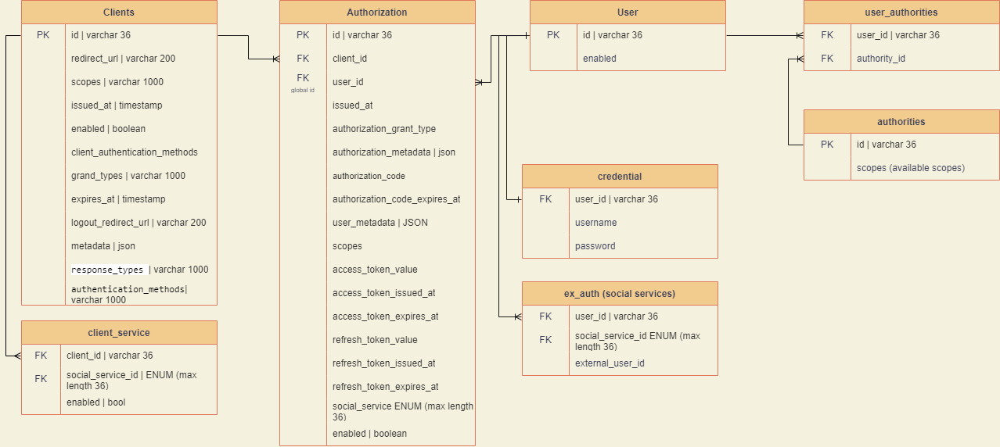

# Mission-id service

> authorization service for identify users in mission ecosystem by login/passwod form and social login services

Ожидаемый результат:
Страница авторизации представляет форму с вводом логина/пароля и возможностью авторизации через соц. сети
сервис реализует протокол OAuth2.1

## Available authorizations flow
1) Authorization code with PCKE (with refresh code)

## Technologies used

Используемые технологии:
1) ktor
2) exposed
3) jjwt
4) postgres database

## Documentation in pictures

Алгоритм авторизации/authorization scheme:

Схема базы данных

# Road map

To view features in roadmap please see project at github. Tasks are  prioritized and will be implemented soon  

# Prototyping

# additional info

for local setup ssl you can generate certificate by using module GeneratorSslKeys and Main.kt. 
After execute the main method keystore.jks will be generated in build folder GeneratorSslKeys module.

## Promotion

New login form (03.01.2024)

> some changes are not described in the README, use can contact me or see the commits