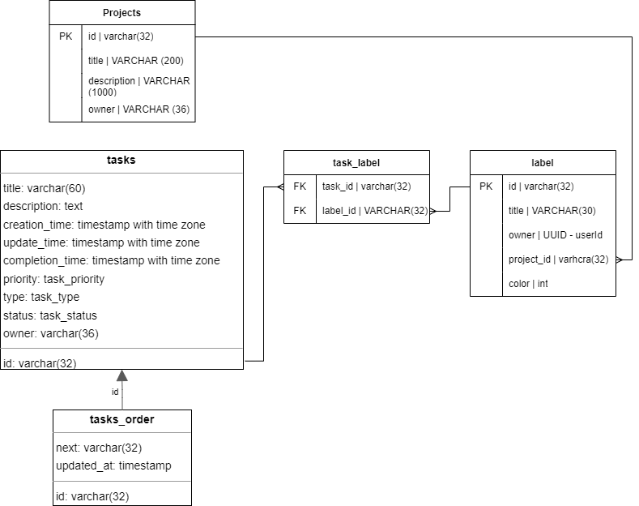
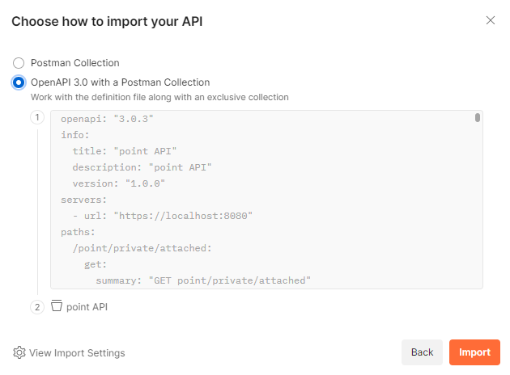

# Mission-point service

KYamshanov`s project for manage own tasks

## Database stucture

### automate testing

для автоматизации тестирования использовать Open Api (swagger) and Postman

to import a schema from swagger (./docs/point-openapi.yaml) to Postman you need:
1) import collection in postman
2) drop .yaml file which located docs/point-openapi.yaml
3) select OpenApi 3.0 with postman collection

4) click import